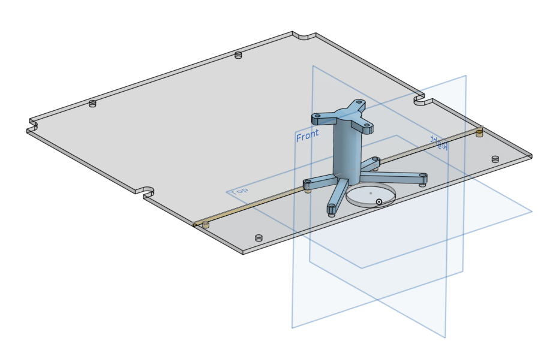

# Lidar Sensor

## Sensor
Der Sensor ist ein [YDLIDAR G4](https://www.ydlidar.com/product/ydlidar-g4) Lidar Sensor. Dieser ist oben auf dem Rover als höchster Punkt Montiert. Der Sensor ist per USB-C zu USB-A Kabel direkt im Raspberry Pi eingesteckt.([stl-Datei](hardware\Sensoren\Lidar\Lidar-G4.stl) vom Lidar-G4)
| Technische Daten | [Datenblatt](https://dedjh0j7jhutx.cloudfront.net/2036899223840006144/ad80f6aedfd4644d2e31936cf75a43ca.pdf) |
| ----------- | ------- | 
| Range Frequency | 9000Hz |
| Scan Frequency | 5-12Hz |
| Range Distance | 0.12-16m |
| Scan Angle | 360° |
| Angle Resolution | 0.2-0.48° |
| Size | Φ72.3*41.2mm |

[User Manual](https://dedjh0j7jhutx.cloudfront.net/2036899223840006144/305459639f160698bb45426b6f4a80f8.pdf) | 
[Development Manual](https://dedjh0j7jhutx.cloudfront.net/2036899223840006144/46fa12e406f3e333ec004c61db97a2ce.pdf) | 
[Tools/Software](https://www.ydlidar.com/download/category/lidar-sensor)

## Befestigung
Der Lidar Sensor ist auf einem 3D Gedrucktem Tower geschraubt. Dieser ist auf einer Alu Platte befestigt, welche einen Teil der Plexiglasplatte des Rovers ersetzt.

Die Alu Platte ist per hand nach diesem Plan gefertigt worden: [Plan](hardware\Sensoren\Lidar\Lidar-G4.stl) 

Der Tower wird 3D gedruckt und dann mit der Alu Platte verschraubt. ([stl-Datei](hardware\Sensoren\Lidar\Lidar_Tower.stl) vom Tower)

## Test
Der Lidar-Sensor kann mit einem PC-getestet werden dazu benötigt man von [YDLidar/downloads](https://www.ydlidar.com/download/category/lidar-sensor):  
- UART BOARD DRIVER-CP210x_VCP_Windows
- Programm    

Es ist wichtig das man zuerst den Triber instaliert und errst anschließend das Programm startet.