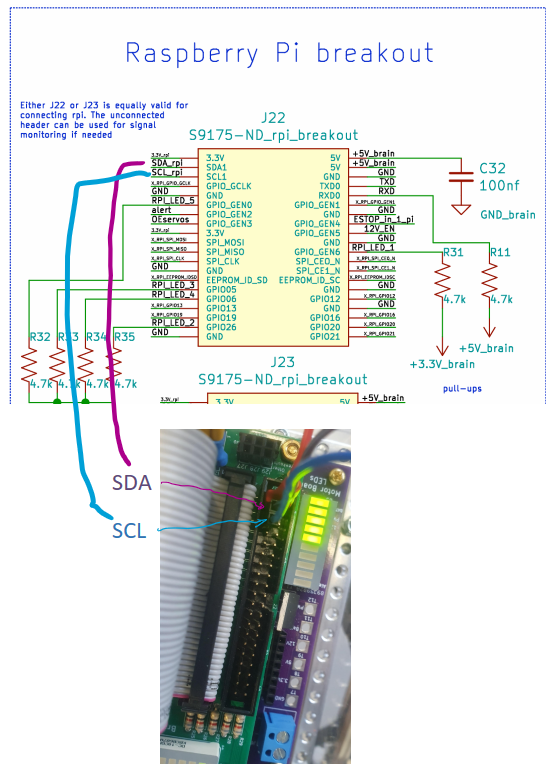

# Servo I2C Übertragung: Versuchsaufbau

Zum Testen der i2c Übertragung wurde ein Arduino Uno an den RaspberryPi angeschlossen und ein "I2C-Sniffer-Code" verwendet um die Daten zu lesen, ohne die Kommunikation zwischen dem RaspberryPi und dem PCA9685 zu stören.

## Aufbau:



### Anschluss von SDA, SCL und GND:

| RaspberryPi | Arduino |
| ----------- | ------- | 
| SCL | PA2 |
| SDA | PA3 |
| GND | GND |

## Arduino "i2c-Sniffer" Code

Das wichtigste hier ist, dass MAX_SAMPLES auf 10 gesetzt wird.
```cpp
// how many START / STOP cycles we want to sample before dumping to console
#define MAX_SAMPLES         10 
```
Nach Ausprobieren, haben wir festgestellt, dass so die gesamte Länge der Übertragung vollständig abgefangen wird.

Bei der Ausgabe wird mit **+** und **-** gekennzeichnet ob die Daten Acknowledged werden (**+**) oder nicht Aknowledged werden (**-**)

# Test Durchführung

1. SSH Verbindung zum Rover aufgebaut (siehe [SSH Verbindung zum Rover](/README.md))
2. calibrate_servos.py skript aufgerufen (siehe [rover_bringup.md](/src/osr-rover-code/setup/rover_bringup.md)
3. Arduino mit PC Verbunden, Code hochgeladen und in ArduinoIDE SerialMonitor aufgerufen
4. beliebigen Servo ausgewählt und markanten Winkel eingestellt

Schritt 4 mehrmals durchgeführt um Änderungen in der Übertragung zu erkennen. Dabei kleinschrittig Änderungen vorgenommen:

- anzusteuernden Servo geändert
- Winkel nicht geändert
- Winkel um großen Wert geändert
- Winkel um 1 geändert
- Winkel auf 0 gesetzt

# Ergebnisse 

Folgende Ausgabe dient als Beispiel:
```
Queue was filled: 118
80+ 40+ 00+ 00+ 20+ 00+ 30+ 40+ 28+ 00+ 01+ 04+ 07-
E3-
92+ 00+ 00+ 01+ 00+ 01+ 80-
00+ 00-
81+ 20-
80+ 00+ 30+ 80+ FE+ 79+ 80+ 00+ 20+ 80+ 00+ A0+ 80+ FE+ 81+ 50-
80+ FE+ 81+ 50-
80+ FE+ 81+ 50-
80+ FE+ 81+ 50-
80+ 12+ 00+ 00+ CE+ 01+  <--- einzige Zeile die sich ändert 
```
*Anmerkung: Winkel wurde bei Servo 3 (hinten rechts) auf 150 gestellt*

Wir haben festgestellt, dass bei einstellen anderer Servos und Winkel nur die letzten Packete von Bedeutung sind (die anderen ändern sich nicht).

Wir haben 3 Servos getestet (0, 1, 3) (2 sollte noch getestet werden) und folgende Übertragung erhalten:
| Eingestellter Winkel  | HR 0 | VR 1 | HL 3 |
| --------------------  | ---- | ---- | ---- |
| 0                     |      |      |      |
| 150                   | 80+ 12+ 00+ 00+ CE+ 01+ | 80+ 06+ 00+ 00+ CE+ 01+ | 80+ 0A+ 00+ 00+ CE+ 01+ |
| 200                   | 80+ 12+ 00+ 00+ 35+ 02+ | 80+ 06+ 00+ 00+ 35+ 02+ | 80+ 0A+ 00+ 00+ 35+ 02+ |
| 300                   | 80+ 12+ 00+ 00+ 03+ 03+ | 80+ 06+ 00+ 00+ 03+ 03+ | 80+ 0A+ 00+ 00+ 03+ 03+ |

## Analyse

*Anmerkung: In der Analyse wird eine übertragung in "Packete" eingeteilt, ein Paket beschreibt einen Teil der Übertragung der so aussieht:* **80+** *12+ 00+ .... Dies wird als das "erste Packet" beschrieben. Die Nummerierung geht von links nach rechts.* 

Wir können folgendes beobachten:
- die Zeile fängt immer mit **80** an 
- der Kanal (Servo) wird über das zweite Paket bestimmt
    - HR 0: 12
    - VR 1: 06
    - HR 2:
    - HL 3: 0A 
- der Winkel wird über die letzten 2 Pakete bestimmt
    - 150: CE 01
    - 200: 35 02
    - 300: 03 03
    - Es scheint, als ob große Winkel zu einer kleineren Nummer führen, aber es könnte auch sein, dass die Bits andersrum gelesen werden. Bzw. hängt es wahrscheinlich davon ab wie die Pulse übertragen werden.