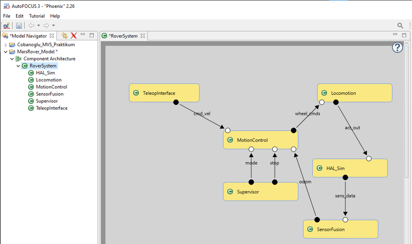
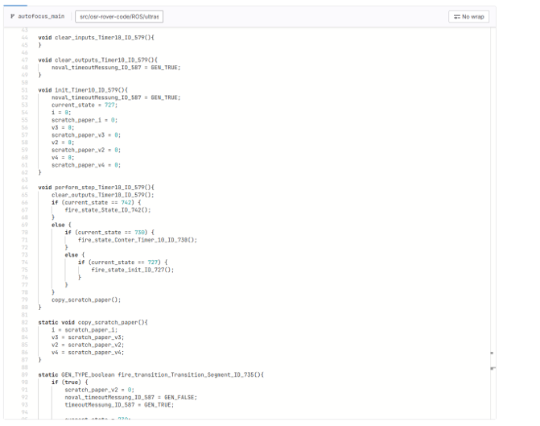

## Ursprüngliche Projektidee

Die ursprüngliche Projektidee des Projekts **IP-Mars-Rover** war es, einen **modellbasierten Entwicklungsprozess** für einen Rover zu untersuchen.

Konkret sollte ein **kleiner, abgegrenzter Teil der Rover-Logik** in **Autofocus 3** modelliert werden.

Der geplante Ablauf umfasste folgende Schritte:

1. Modellierung einer ausgewählten Rover-Funktionalität in **Autofocus 3**
2. Test und Validierung des Modells innerhalb von Autofocus
3. Automatische **Erzeugung von C-Code** aus dem Autofocus-Modell
4. Nutzung unterschiedlicher **Plugins und Werkzeuge zur automatischen Umwandlung von C-Code in Python-Code**
5. Versionierung des erzeugten Codes im Repository
6. Ausführung und Simulation des Codes innerhalb einer **ROS-basierten Umgebung**
7. Visualisierung und Überprüfung des Verhaltens mittels **RViz** und **Gazebo**

Ziel war es, den vollständigen Weg von der Modellierung bis zur lauffähigen Simulation abzubilden.

---

## Finales Projektziel

Nach der dreimonatigen Projektlaufzeit wurde das Projektziel präzisiert und realistisch angepasst:

> Erstellung eines einfachen, getesteten Modells in Autofocus 3,
> 
> 
> 
> 
> 
> automatische Generierung von **C-Code**,
> 
> anschließende (teil-)automatische Umwandlung in **Python-Code**,
> 
> fehlerfreier Commit und Push des Codes in das Repository
> 
> sowie die erfolgreiche Ausführung und Simulation in einer **ROS-Umgebung mit RViz und Gazebo**.
> 

Der Fokus lag dabei weniger auf der funktionalen Vollständigkeit des Rover-Modells, sondern auf der **Machbarkeit und Stabilität der verwendeten Toolchain**.

---

## Erfolgskriterien

Das Projekt wurde als erfolgreich bewertet, wenn die folgenden Kriterien erfüllt sind:

- Ein Modell wurde erfolgreich in **Autofocus 3** erstellt und getestet
- **C-Code konnte automatisch aus Autofocus 3 generiert werden**
- Der generierte C-Code wurde **mithilfe von Plugins oder Tools in Python-Code umgewandelt**
- Der Code wurde **fehlerfrei in das Repository integriert (Commit & Push)**
- Die Simulation in einer **ROS-basierten Umgebung** lief stabil
- Die Visualisierung und Ausführung in **RViz und Gazebo** funktionierte ohne kritische Fehler

---

Nicht alle Ansätze haben vollständig funktioniert, weshalb:

- bekannte Probleme dokumentiert wurden
- nicht funktionierende Konfigurationen bewusst erhalten geblieben sind
- Versionsabhängigkeiten eine zentrale Rolle spielen