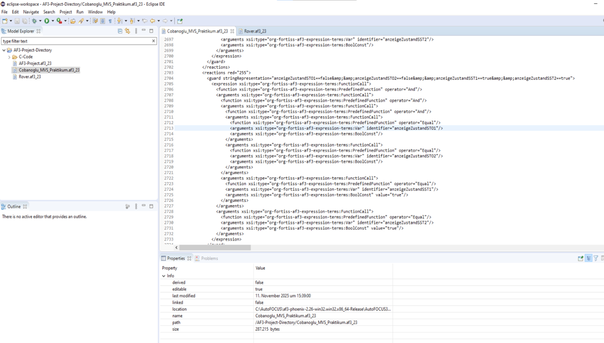
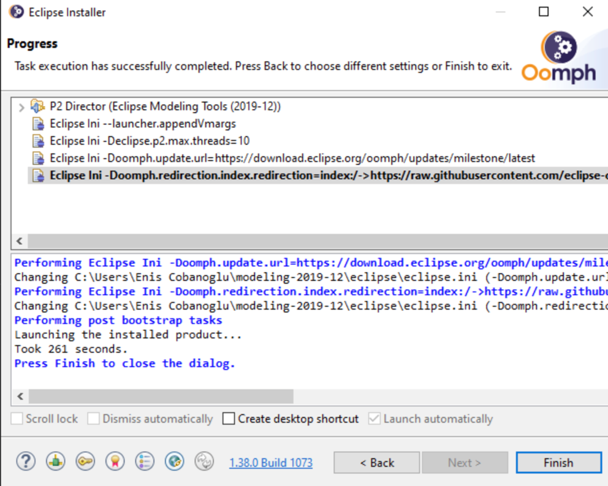
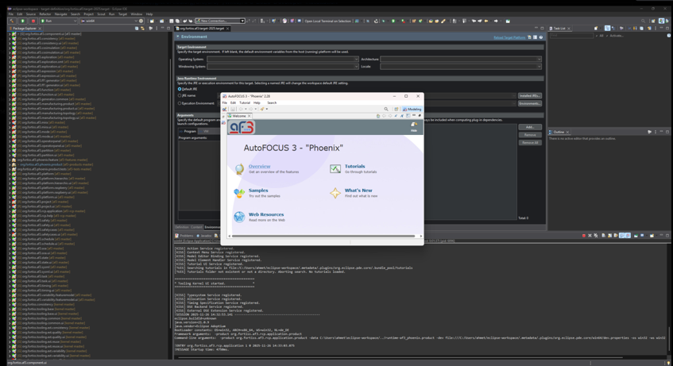
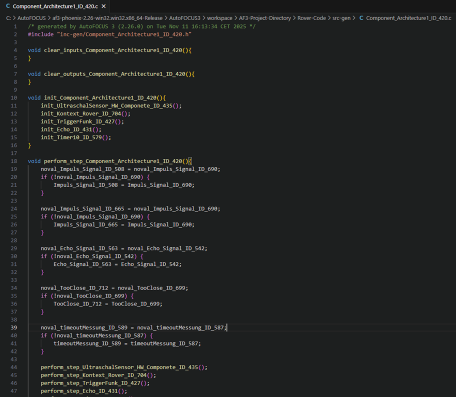
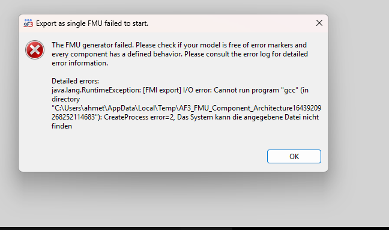
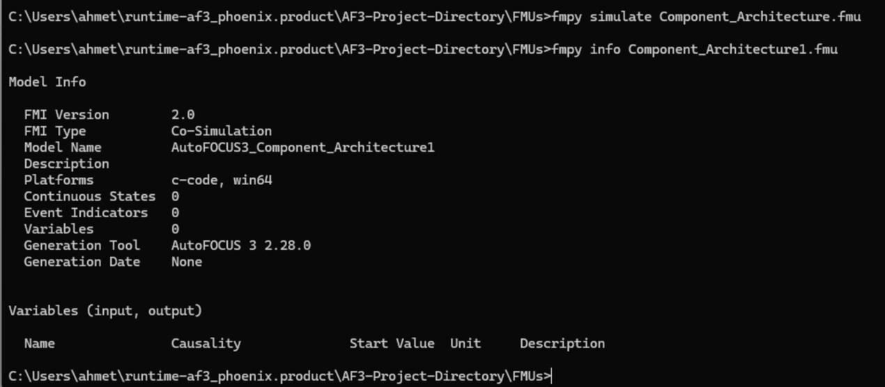
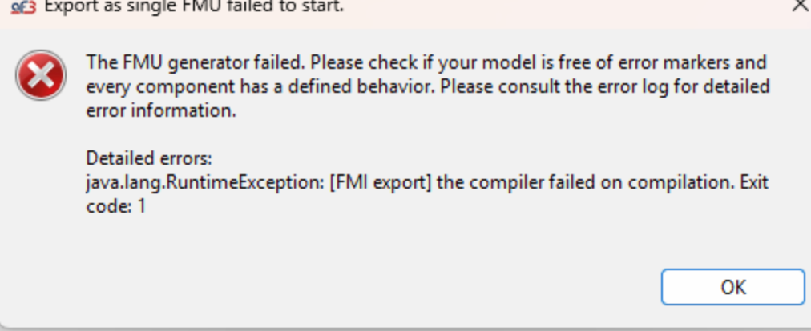
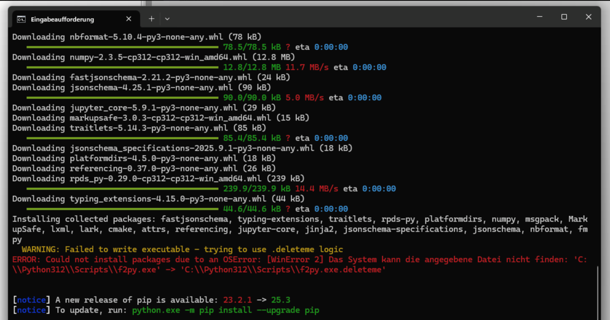
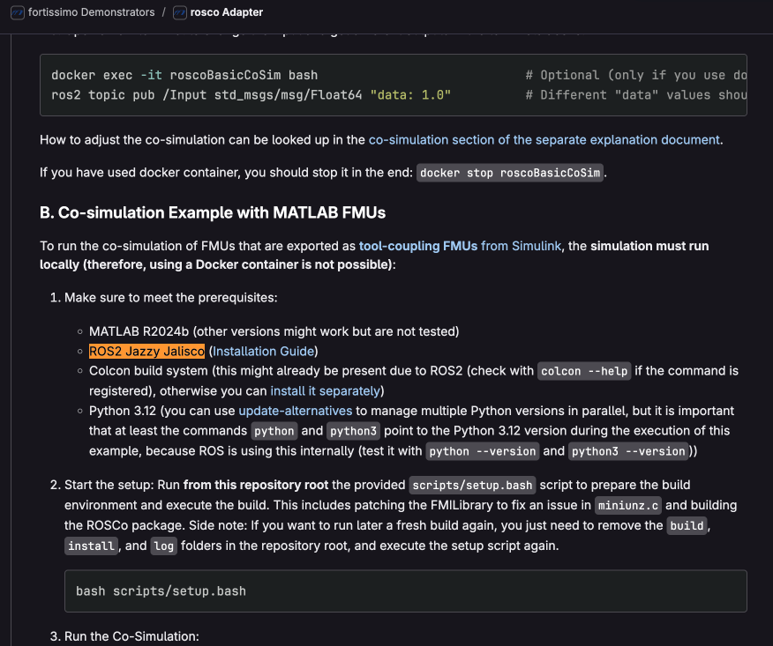

# Konfiguration

Dieses Dokument beschreibt die **verwendeten Konfigurationen**, **Umgebungsvariablen** und **zentralen Einstellungen**, die im Projekt notwendig waren.

Zusätzlich werden **nicht funktionierende Konfigurationen** dokumentiert, um zukünftigen Projektgruppen unnötige Fehlversuche zu ersparen.

---

## Basis-Repository und Ausgangspunkt

Als Grundlage für die Simulation und ROS-Integration wurde das folgende Repository verwendet:

- **NASA JPL OSR Rover Code (GitHub)**
    - dient als **Basissimulation**
    - enthält die **Kernfunktionalität des Rovers**
    - wurde **nicht vollständig verändert**, sondern erweitert und angebunden

Dieses Repository definiert die verwendete **ROS-2-Version**, die Build-Struktur sowie die Simulationsumgebung mit **RViz** und **Gazebo**.

---

## Betriebssystem und ROS-Installation

### Erfolgreiche Konfiguration

Die **einzige stabil funktionierende Konfiguration** war:

- **Windows 11**
- **Ubuntu 22.04.5 LTS**
    - installiert über den **Microsoft Store**
- **ROS 2 Humble**

Diese Kombination ermöglichte:

- stabile ROS-Installation
- funktionierende Build-Prozesse
- Ausführung der Simulation ohne kritische Laufzeitfehler

---

### Nicht erfolgreiche Konfigurationen (nicht empfohlen)

Folgende Ansätze wurden getestet, aber **bewusst verworfen**:

- **Docker / Containerisierung unter macOS**
    - ROS 2 ließ sich nicht stabil ausführen
    - Build- und Laufzeitprobleme
- **Virtuelle Maschine (Hyper-V Manager)**
    - instabile ROS-Ausführung
    - Performance-Probleme
- **Ubuntu 22.04.5 unter Windows 10 (Microsoft Store)**
    - ROS 2 nicht zuverlässig lauffähig
- **macOS als native Plattform**
    - eingeschränkter ROS-Support
    - hoher Konfigurationsaufwand
    - frühe Abbrüche

**Empfehlung für Folgeteams:**

Nur **Windows 11 + Ubuntu 22.04.5 (Microsoft Store)** verwenden.

---

## Autofocus 3 – Developer-Versionen

### Verwendete Versionen

Es wurden zwei **Autofocus 3 Developer-Versionen** getestet:

- **Developer-Version 2024**
    - benötigt alte Java- und Eclipse-Versionen
    - zahlreiche:
        - Kompilierungsfehler
        - Konfigurationsprobleme
    - **nicht stabil nutzbar**

- **Developer-Version 2025 (fortiss-Repository)**
    - funktionierte stabil
    - erforderliche Abhängigkeiten:
        - **Java 21**
        - **Eclipse Temurin 21**

**Empfehlung:**

Ausschließlich die **neue Developer-Version (2025)** verwenden.

---

## Manueller Ansatz – Konfigurationsprobleme

Zu Beginn wurde ein **manueller Ansatz** verfolgt, bei dem der von Autofocus erzeugte C-Code händisch angepasst wurde.

### Typische Probleme

- Fehler bei:
    - **INC-GEN** (Header-Dateien)
    - **SOURCE-GEN** (C-Quellcode)
- Konflikte durch:
    - reservierte Namen
    - inkonsistente Namenskonventionen
- Probleme mit Autofocus-internen Boolean-Werten:
    - `GEN_TRUE`
    - `GEN_FALSE`

### Lösungsversuche

- Umbenennung der Boolean-Werte in:
    - eigene, projektspezifische Variablennamen
- Vermeidung von Namenskonflikten mit C/C++-Konventionen

Trotz teilweiser Verbesserungen blieb der manuelle Ansatz:

- fehleranfällig
- zeitaufwendig
- nicht nachhaltig

Daher wurde er **nach kurzer Zeit verworfen**.

---

## Automatisierter Ansatz – Adapter & Exporte

### FMU-Export und FMI-Adapter

- Es wurde ein **FMU-Export** in Kombination mit einem **FMI-Adapter (fortiss)** verwendet
- Voraussetzungen:
    - installierter **GCC-Compiler** (empfohlen: neueste Version)

Wichtige Einschränkungen:

- FMO-Export funktioniert **nur auf Top-Level-Komponenten**
- verschachtelte Modelle werden **nicht rekursiv exportiert**
- Modelle müssen:
    - explizite Inputs und Outputs besitzen

---

### Adapter- und ROS-Kompatibilität

- Der verwendete **FME-Adapter** basiert auf:
    - **catkin** → **ROS 1**
- Das Projekt nutzt jedoch:
    - **ROS 2**
    - **ament** als Build-System

Ergebnis:

- FME-Adapter **inkompatibel**
- automatisierte Weiterverarbeitung nicht möglich
---

### ROSCO-Adapter

- Alternativ wurde der **ROSCO-Adapter** getestet
- Problem:
    - Adapter basiert auf einer **anderen ROS-2-Version**
    - Projekt verwendet **ROS 2 Humble**

Ergebnis:

- Versionsinkompatibilität
- Build- und Laufzeitfehler
- Adapter nicht weiterverfolgt

---

## Wichtige Environment-Variablen

Abhängig von Setup, Eclipse und Adapter mussten u. a. folgende Variablen angepasst werden:

- `JAVA_HOME`
- `PATH` (Java, GCC, ROS)
- `AMENT_PREFIX_PATH`
- `COLCON_PREFIX_PATH`
- Eclipse-spezifische Plugin-Pfade
- Adapter-spezifische Konfigurationspfade

**Hinweis:**

Diese Variablen sind **versions- und adapterabhängig** und müssen bei jeder neuen Umgebung überprüft werden.

---

## Zentrale Erkenntnisse für zukünftige Gruppen

- Adapter müssen **exakt zur ROS-Version passen**
- ROS 1 und ROS 2 sind **nicht kompatibel**
- Unterschiedliche ROS-2-Versionen sind **nicht automatisch kompatibel**
- Build-Systeme (**catkin vs. ament**) sind entscheidend
- Developer-Versionen von Autofocus unterscheiden sich massiv
- GCC ist für Exporte zwingend erforderlich

---

## Zusammenfassung

Die Konfiguration des Projekts war stark abhängig von:

- Tool-Versionen
- Betriebssystem
- Adapter-Kompatibilität

Viele Probleme entstanden nicht durch die Modellierung selbst, sondern durch **Versions- und Konfigurationskonflikte**.

Diese Dokumentation soll zukünftigen Projektgruppen helfen, direkt mit einer **funktionierenden Konfiguration** zu starten.