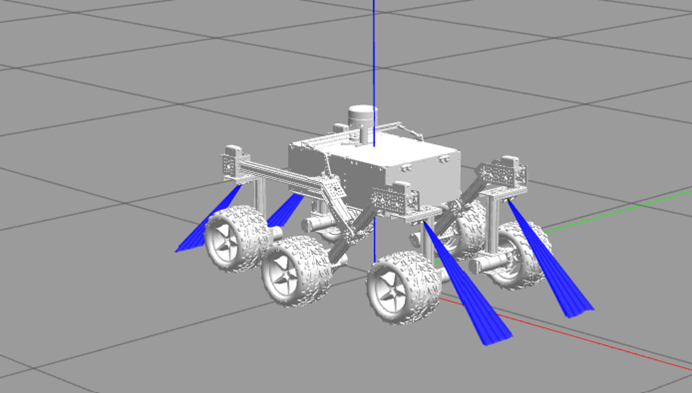
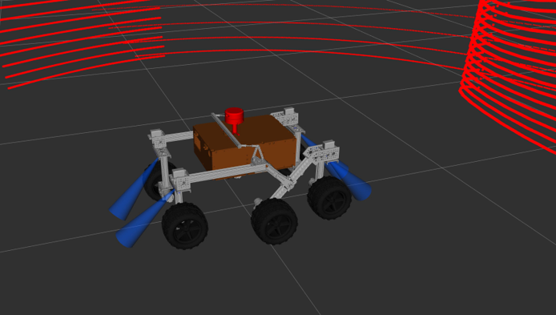

# WSL
Wenn ihr Windows verwendet, müsst ihr WSL nutzen, um mit der Simulation arbeiten zu können. Das geht ganz einfach: Im Microsoft Store nach "Ubuntu 22.04.5 LTS" suchen und installieren. Es MUSS die Version 22.04.5 LTS sein. 


Die Alternative wäre, eine VM mit dieser Ubuntu Version zu nutzen, empfohlen wird WSL.
# Installieren
1. ROS Humble installieren:
```bash
sudo apt update && sudo apt install locales
sudo locale-gen en_US en_US.UTF-8
sudo update-locale LC_ALL=en_US.UTF-8 LANG=en_US.UTF-8
export LANG=en_US.UTF-8

sudo apt install software-properties-common
sudo add-apt-repository universe

sudo apt update && sudo apt install curl -y
export ROS_APT_SOURCE_VERSION=$(curl -s https://api.github.com/repos/ros-infrastructure/ros-apt-source/releases/latest | grep -F "tag_name" | awk -F\" '{print $4}')
curl -L -o /tmp/ros2-apt-source.deb "https://github.com/ros-infrastructure/ros-apt-source/releases/download/${ROS_APT_SOURCE_VERSION}/ros2-apt-source_${ROS_APT_SOURCE_VERSION}.$(. /etc/os-release && echo ${UBUNTU_CODENAME:-${VERSION_CODENAME}})_all.deb"
sudo dpkg -i /tmp/ros2-apt-source.deb

sudo apt update
sudo apt upgrade

sudo apt install ros-humble-desktop
sudo apt install ros-humble-ros-base
sudo apt install ros-dev-tools

source /opt/ros/humble/setup.bash
```
2. ROS2 Packages installieren
```bash
sudo apt install python3-colcon-common-extensions
sudo apt-get install ros-humble-rviz2
sudo apt-get install ros-humble-controller-manager
sudo apt-get install ros-humble-robot-state-publisher
sudo apt-get install ros-humble-joint-state-publisher
sudo apt-get install ros-humble-joint-state-publisher-gui 
sudo apt-get install ros-humble-gazebo-ros-pkgs
sudo apt-get install ros-humble-trajectory-msgs
sudo apt-get install ros-humble-velocity-controllers
sudo apt-get install ros-humble-joint-trajectory-controller
sudo apt-get install ros-humble-gazebo-ros2-control-demos

source /opt/ros/humble/setup.bash
```
3. Git Repo in das Homeverzeichnis des Accounts clonen
```bash
cd /home/<accountname>
git clone https://git.fh-aachen.de/ip-marsrover-ws25/marsrover-ws25.git IP-Marsrover
```
4. Symlink builden (WICHTIG: Im Gazebo Ordner)
```bash
cd ~/IP-Marsrover/src/osr-rover-code/ROS/osr_gazebo
colcon build --symlink-install
```
5. Sourcen und Starten
```bash
source /opt/ros/humble/setup.bash
source ~/IP-Marsrover/src/osr-rover-code/ROS/osr_gazebo/install/setup.bash
```
Zum Automatisieren des Sourcens bei jedem neuen Terminal siehe Schritt 7.

WICHTIG: jeden Launch- bzw. Run-Befehl in einem neuen Terminal starten (Und, wenn noch nicht Schritt 7 erledigt wurde, jedes Mal sourcen!)
```bash
ros2 launch osr_gazebo test_world.launch.py
ros2 run teleop_twist_keyboard teleop_twist_keyboard
ros2 launch osr_gazebo rviz.launch.py
```

7. Aliase und Sourcen automatisieren:
Damit nicht bei jedem neuen Terminal das Sourcen selbst ausgeführt werden muss:
```bash
nano .bashrc
```
In der Datei bis ganz unten scrollen und Folgendes hinzufügen:
```bash
source /opt/ros/humble/setup.bash
source ~/IP-Marsrover/src/osr-rover-code/ROS/osr_gazebo/install/setup.bash

# Alias für leichtere Bedienung
alias build='cd ~/IP-Marsrover/src/osr-rover-code/ROS/osr_gazebo && colcon build --symlink-install && source /opt/ros/h>
alias osr="cd ~/IP-Marsrover/src/osr-rover-code/ROS/osr_gazebo"
alias gazebo="ros2 launch osr_gazebo world.launch.py"
alias rviz="ros2 launch osr_gazebo rviz.launch.py"
alias teleop="ros2 run teleop_twist_keyboard teleop_twist_keyboard"
```
Anschließend mit Strg + O abspeichern.

# WSL-Images exportieren und importieren:
Zur Sicherung und Übertragung von WSL-Installationen bietet es sich an, diese als .tar zu exportieren. Es handelt sich hierbei um einen 1:1 Klon der jeweiligen Umgebung. Dies kann zum Austausch zwischen den verschiedenen Nutzern oder bei Problemen bei der Installation verwendet werden.

Liste aller Distributionen anzeigen:
```bash
wsl --list --verbose
```
Backup exportieren: (Pfade entsprechend anpassen)
```bash
wsl --export Ubuntu-22.04 C:\Backups\ubuntu_backup.tar
```
Backup importieren: (Pfade entsprechend anpassen)
```bash
wsl --import Ubuntu-22.04 C:\WSL\Ubuntu C:\Backups\ubuntu_backup.tar --version 2
```
Vorhandene Instanz entfernen: (Pfade entsprechen anpassen)
```bash
wsl --unregister Ubuntu-22.04
```
Wir haben ein entsprechendes Image unter https://fh-aachen.sciebo.de/s/tziQDgpgJ9RR6oH bereitgestellt, dieses ist auf dem Stand vom 23.10.2025, neue Änderungen müssen somit aus Git gepullt werden.

Nach dem Import ist man standardmäßig als root angemeldet, um dies zu ändern: (In diesem Image heißt der gewünschte User ip_m mit dem Passwort ip_m)
```bash
wsl
printf "[user]\ndefault=ip_m\n" > /etc/wsl.conf
exit
wsl --shutdown
```
# Verwendete Ressourcen:
1. ROS2 Humble: https://docs.ros.org/en/humble/Installation.html
2. ROS2 Packages: https://github.com/nasa-jpl/osr-rover-code/tree/master/ROS/osr_gazebo#ros-package-installation

Wichtig: Im offiziellen Repo exisitiert eine COLCON_IGNORE Datei. Diese Datei verhindert, dass das Package gebaut wird. Dieses File muss gelöscht werden. In diesem Repo exisitert es nicht mehr.

Wenn es Unklarheiten gibt, stehen die Instruktionen auch nochmal im offiziellen Repo: https://github.com/nasa-jpl/osr-rover-code/tree/master/ROS/osr_gazebo

# Sourcing
Um mit Gazebo und Ros2 arbeiten zu können, müsst ihr oft mehrere Terminals gleichzeitig offen haben. Damit ros2 und gazebo funktioniert, müsst ihr die richtigen Files bei jedem öffnen eines neuen Terminal sourcen. Da das sehr nervig sein kann, empfehle ich euch, das sourcen in die .bashrc zu schreiben. Dieses file wird für ein neu gestartetes Terminal ausgeführt. 

Öffnet im Home verzeichnis eures Nutzers die .bashrc datei
```bash
cd ~
nano .bashrc
```
Geht an das Ende der Datei und tragt folgendes ein
```
source /opt/ros/humble/setup.bash
source ~/osr/ROS/osr_gazebo/install/setup.bash

alias osr="cd ~/osr-rover-code/ROS/osr_gazebo"
alias gazebo="ros2 launch osr_gazebo empty_world.launch.py"
alias rviz="ros2 launch osr_gazebo rviz.launch.py"
alias teleop="ros2 run teleop_twist_keyboard teleop_twist_keyboard"
```
Die beiden source befehle sind nötig, die alias befehle sind optional, sparen euch aber viel Zeit.
- Wenn ihr osr ins Terminal eingebt, springt ihr in den Ordner der Simulation 
- Wenn ihr gazebo ins Terminal eingebt startet ihr die simulation, welche genau könnt ihr im alias anpassen
- Wenn ihr Rviz ins Terminal eingebt startet ihr die rviz
- Wenn ihr teleop ins Terminal eingebt startet ihr die Tastatursteuerung für den Rover
# Ros2 
Um zu verstehen, wie ros funktioniert, empfehlen wir folgende Quellen durchzugehen:
- https://docs.ros.org/en/humble/Tutorials/Beginner-CLI-Tools.html
- https://docs.ros.org/en/humble/Tutorials/Beginner-Client-Libraries.html
- (optional) https://docs.ros.org/en/humble/Tutorials/Intermediate.html
- https://docs.ros.org/en/humble/Concepts/Basic.html
# Projektstruktur
- launch -> Hier befinden sich alle launchfiles. Ihr könnt hier eigene launchfiles hinzufügen
- urdf -> Hier befinden sich alle Dateien, die den Rover und die Simulation definieren
- worlds -> Fertige Welten zum laden
- models -> Hier befinden sich Models für die Simulation, z.B. Räume die man erstellt hat
- config -> Hier befinden sich config files für Nav2 und slam_toolbox
# Sensoren
Sensoren die man hinzufügen möchte, werden im gazebo.urdf.xacro file definiert. Dieses File wird dann vom osr.urdf.xarco file, dass den Rover definiert, importiert.
## Lidar Sensor 
Der Lidar Sensor liefert seine Daten über das Topic "/lidar_plugin/out". Hier im Bild sieht man die Visualisierung der Daten einer Wand über Rviz


## Ultraschallsensoren
Wir haben vier funktionsfähige Ultraschallsensoren erfolgreich an den beiden Vorder- und Hinterrädern angebracht und diese mit geeigneten Modellen visualisiert.
Diese vier Ultraschallsensoren veröffentlichen über ihre jeweils eigenen Topics Daten der Sensoren, die man sich wie folgt anschauen kann:

Mit diesem Befehl kann man bei laufender Gazebo-Simulation die laufenden Topics anschauen:
```bash
ros2 topic list
```
Hier werden die vier Ultraschallsensoren über „/ultrasonic_sensor_xx” angezeigt.
```bash
ros2 topic echo /ultrasonic_sensor_fl
```
Mit diesem Befehl kann man sich beispielsweise den Output des Frontwheel-Left-Topics ausgeben lassen. Das Terminal gibt nun die Entfernung zum nächsten kollidierenden Objekt an.
Testweise kann man sich nun auch einen Block vor bzw. hinter den Rover setzen und in der Terminalkonsole beobachten, wie sich die Range-Daten zum nächsten Objekt verkleinern.

Sollte es im Verlauf notwendig sein, die Ultraschallsensoren zu bearbeiten oder umzupositionieren, kann dies ganz unten in der gazebo.urdf.xacro vorgenommen werden.

Im Folgenden zeigen wir nun Bilder wie die Ultraschallsensoren in der Gazebo & Rviz Simulation aussehen.

Gazebo:



Rviz:



# Laden Objekte wie Räume oder Landschaften
Es sollte möglich sein, erstelle Räume über das Launch File zu starten. Zur Zeit funktioniert das mit dem spawn_entity Node in Option 1

## Option 1
Alles über Launchdatei Laden. Die Beste Option
### Ansatz 1
Eine spawn_entity benutzen, um Raum zusätzlich zum Rover zu spawnen. Das hat funktioniert. So wird der Rover geladen wie es vorgesehen ist, und der Raum unabhängig davon gesetzt.

```python
 # Spawnen des Raums, -file String muss noch dynamisch geladen werden!!!

    spawn_room = Node(
    package='gazebo_ros',
    executable='spawn_entity.py',
    arguments=[
        '-file',   "/home/girskorr/osr/ROS/osr_gazebo/models/room/model.sdf",
        '-entity', 'room',
         '-x',      '0',          
        '-y',      '0',
        '-z',      '0',
        '-R',      '0',
        '-P',      '0',
        '-Y',      '0'
    ],
    output='screen'
)
```
### Ansatz 2
Welt mit dem "world" launch Argument laden. Funktioniert nicht

```python
gazebo = IncludeLaunchDescription(
         PythonLaunchDescriptionSource([os.path.join(
                    get_package_share_directory('gazebo_ros'), 'launch'), '/gazebo.launch.py']),
                    launch_arguments={'use_sim_time':'true', "world": PathJoinSubstitution([
            get_package_share_directory('osr_gazebo'),
            'worlds',
            'test_world_with_rover.world'
        ])}.items())
```


## Option 2
### Schritt 1: Umgebungsordner herunterladen
1. Ladet eine der verfügbaren Umgebungen aus dem Umgebung-Ordner herunter.
2. Alternativ könnnt ihr kompatible Modelle aus dem Internet beziehen.
### Schritt 2: Umgebungsordner in Gazebo einbinden
Kopiert ihr den heruntergeladenen Ordner in den Gazebo-Model-Pfad:
```python
/home/<IHR_BENUTZERNAME>/.gazebo/models/
```
### Schritt 3: Umgebung in Gazebo einfügen
1. Starte die Simulation in Gazebo.
2. Klicke links oben auf „Insert“.
3. Dort findest du die importierten Umgebungen, die du einfach per Klick in die Simulation einfügen kannst.

### Hinweis: Umgebungen aus dem Internet herunterladen
Falls du eine Umgebung aus dem Internet verwendest, beachte folgende Punkte:
Die 3D-Modelldatei die Endung ".dae" besitzt.
Der Ordner muss zusätzlich die Dateien model.sdf und model.config enthalten.
Falls diese Dateien fehlen, kannst du sie auch selbst erstellen und anpassen.

## Option 3
### Welt erstellen
Wenn ihr eine neue Welt erstellen wollt, müsst ihr den Rover als sdf Datei darstellen. Folgendes im urdf ordner ausführen
``` bash
ros2 run xacro xacro your_rover.urdf.xacro > rover.urdf
gz sdf -p rover.urdf > rover.sdf
```
Jetzt könnt ihr eine .world datei definieren, mit dem Rover und einem Model für den Raum / die Landschaft:
``` xml
<!-- test_world.world -->
<?xml version="1.0" ?>
<sdf version="1.8">
  <world name="test_world">
    <!-- Raum als statisches SDF-Modell -->
    <include>
 <uri>file:///pfad_zum_package/osr_gazebo/models/room/model.sdf</uri><pose>0 0 0 0 0 0</pose>
    </include>
    <!-- Rover-Modell -->
    <include>
      <uri>file:///pfad_zum_package/osr/ROS/osr_gazebo/urdf/rover.sdf</uri>
      <name>rover</name>
      <pose>0 0 0.1 0 0 1.57</pose>
    </include>
  </world>
</sdf>
```
Dann die Simulation mit dieser .world Datei starten:
```bash
ros2 launch gazebo_ros gazebo.launch.py world:=/pfad/zu/test_world.world
```
Das Problem: 
Prozesse wie " load_joint_state_controller", "rover_wheel_controller" oder "servo_controller", die in der Launchdatei gestartet werden, werden mit dieser Methode ausgelassen. Diese Simulation ist also nicht voll funktionsfähig.


# Rviz2
Mit Rviz lassen sich alle Daten, die ROS2 oder Gazebo über Topics liefern, visualisieren. Was genau gezeigt wird,  steht in der custom_settings.rviz im rviz Ordner. Diese Settingsdatei wird in der rviz.launch.py geladen. Wenn ihr eine andere Settingsdatei laden wollt, könnt ihr diese im rviz Ordner ablegen und in der rviz.launch.py laden. Um eine Settingsdatei zu erstellen, könnt ihr eigene Displays in Rviz hinzufügen, und die aktuelle ansicht per File->save_as im rviz ordner ablegen. 

# Nav2 und Slam
Siehe: https://docs.nav2.org/tutorials/docs/navigation2_with_slam.html
## Vorgehen 
1. Gazebo über launch datei starten und keyboard steuerung starten
```bash
ros2 launch osr_gazebo empty_wordl.launch.py
ros2 run teleop_twist_keyboard teleop_twist_keyboard
```

2. Nav2 starten
```bash
ros2 launch nav2_bringup navigation_launch.py
```

3. Slam toolbox starten, mit den passenden Argumenten: 
``` bash
 ros2 launch slam_toolbox online_async_launch.py \
  slam_params_file:=/pfad/zu/deinem/mapper_params.yaml \
  use_sim_time:=true
```

4. Mit dem Rover herumfahren über teleop. Die Slam Toolbox erstellt nun die Karte. Die Karte wird über das /map topic veröffentlicht. Über Rviz kann man die aktuelle Karte anzeigen lassen. 

5. Wenn man mit der Karte zufrieden ist, kann sie über den Befehl 
```bash
ros2 run nav2_map_server map_saver_cli -f ~/map
```
gespeichert werden. Der Pfad kann über -f option angegeben werden

Diese Option ist etwas aufwendig. Wenn es in dieser Variante funktioniert hat, kann man als nächsten Schritt eine launch Datei schreiben, die die Simulation, Nav2 und Slam toolbox automatisch starten. 

Der nächste Schritt ist, die fertige Karte beim starten der Gazebo simulation zu laden. 

Falls ihr Probleme bei der Installation von Nav2 oder slam_toolbox habt, kann folgender Code helfen:
``` python
sudo apt update sudo apt upgrade

# Alte ROS-Liste entfernen,
sudo rm /etc/apt/sources.list.d/ros2.list
# Neuen Schlüssel hinzufügen,
sudo curl -sSL [https://raw.githubusercontent.com/ros/roadistro/master/ros.key](https://raw.githubusercontent.com/ros/roadistro/master/ros.key "https://raw.githubusercontent.com/ros/roadistro/master/ros.key") -o /usr/share/keyrings/ros-archive-keyring.gpg
# Repository-Quelle neu hinzufügen (für Ubuntu 22.04 Jammy),
echo "deb [arch=$(dpkg --print-architecture) signed-by=/usr/share/keyrings/ros-archive-keyring.gpg] [http://packages.ros.org/ros2/ubuntu](http://packages.ros.org/ros2/ubuntu "http://packages.ros.org/ros2/ubuntu") jammy main" | sudo tee /etc/apt/sources.list.d/ros2.list > /dev/null
# Paketlisten aktualisieren,
sudo apt update
```


# Probleme
Die Slamtoolbox und Nav2 zeigen beide an, dass Transforms verworfen werden, da sie zu alt sind. Das Problem ist wahrscheinlich, das Nodes verschiedene Zeiten benutzen, nämlich Simtime und Systemtime. Es muss irgendwie möglich sein, alle Nodes so zu konfigurieren, dass sie die Simtime benutzen. 
Debug Ausgabe:
```
Desired controller update period (0.01 s) is slower than the gazebo simulation period (0.001 s).
```


# TODOS
- Pfade im test_world.launch.py dynamisch laden
- Position des Room Models anpassen, so dass der Rover innerhalb des Raums Startet
- Zeitproblem im Nav2 Kontext lösen (Symtime vs. Systemtime)
- launch file für Nav2 + slam_toolbox schreiben 
- Wenn Nav2 und Slam funktionieren, eine Map erstellen und laden
- yaml files im launchfile für Nav2 + Slam werden noch nicht richtig geladen
- Restliche Ultraschallsensoren hinzufügen, am besten per xacro macro
- Ultraschallsensoren in Rviz mit "Range" Display anzeigen
- 3D Modelle für Ultraschallsensoren und Lidar hinzufügen. Passende Modelle findet man unter https://app.gazebosim.org/fuel/models
